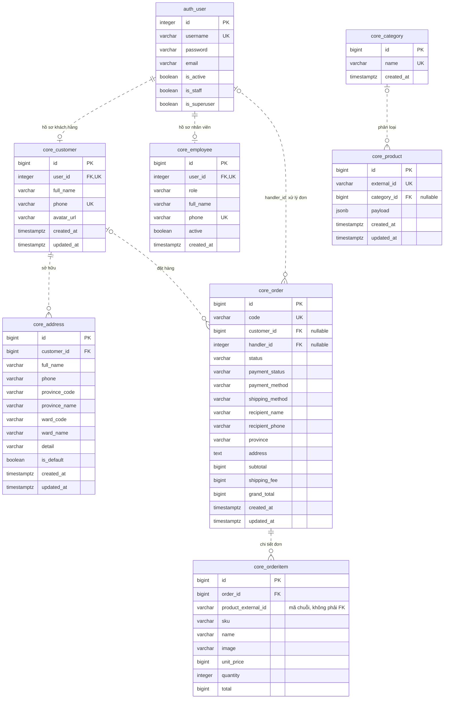
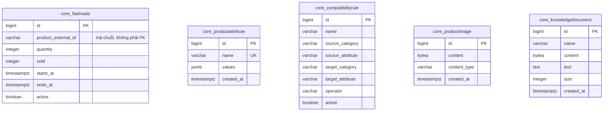

# Sơ đồ cơ sở dữ liệu TechZone

Bản vẽ theo skill `diagram-skills-package`: [TechZone ERD](techzone/srs/techzone-erd.md).

Sơ đồ dựa trên `src/backend/core/models.py` và cấu hình Django hiện tại, không phải kết quả kiểm tra database đang chạy. Bao gồm 12 bảng nghiệp vụ và bảng tài khoản `auth_user`. Các bảng hệ thống khác của Django (session, quyền, nhóm, migration, admin log) được lược bỏ; `auth_user` chỉ hiển thị các trường chính.

PK: khóa chính; FK: khóa ngoại; UK: duy nhất. Tất cả bảng nghiệp vụ có khóa chính `id` kiểu bigint do Django tự tạo. Kiểu dữ liệu dưới đây tương ứng PostgreSQL.

## Quan hệ có khóa ngoại

## Các bảng chưa có khóa ngoại

## Lưu ý khi đọc sơ đồ

- Mỗi hồ sơ khách hàng hoặc nhân viên thuộc đúng một tài khoản. Một tài khoản có thể không có hồ sơ khách hàng hoặc nhân viên.
- Một khách hàng có nhiều địa chỉ và đơn hàng. `customer_id` của đơn hàng cho phép NULL.
- Một danh mục có nhiều sản phẩm; sản phẩm có thể chưa có danh mục.
- Một đơn hàng có nhiều dòng chi tiết. Schema không ép đơn hàng phải có ít nhất một dòng.
- Người xử lý đơn (`handler_id`) tham chiếu trực tiếp `auth_user`, không tham chiếu `core_employee`.
- `product_external_id` trong chi tiết đơn và flash sale dùng để liên hệ sản phẩm theo mã, nhưng không có ràng buộc FK đến `core_product.external_id`.
- Thông tin chi tiết sản phẩm được lưu trong `payload` kiểu JSONB. `ProductAttribute`, `ProductImage` và `CompatibilityRule` chưa có FK đến sản phẩm/danh mục.
- Địa chỉ giao hàng trong đơn được lưu bằng các trường riêng; đơn không có FK đến `core_address`.
- Xóa tài khoản kéo theo xóa hồ sơ khách hàng/nhân viên; xóa khách hàng kéo theo xóa địa chỉ. Django đặt tham chiếu khách hàng/người xử lý trong đơn thành NULL khi đối tượng tương ứng bị xóa. Xóa danh mục đặt danh mục của sản phẩm thành NULL; xóa đơn kéo theo xóa chi tiết đơn. Đây là hành vi `on_delete` của Django ORM.
